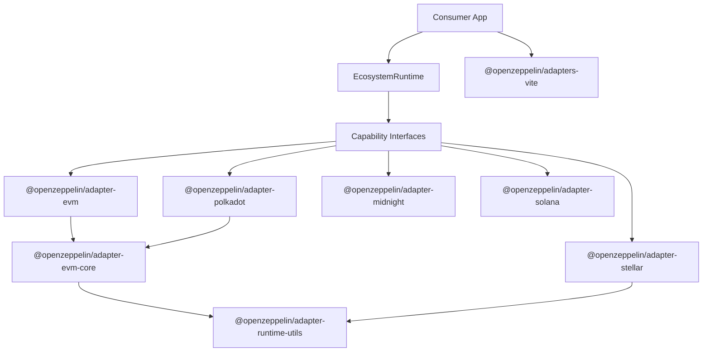

# OpenZeppelin Adapters

> OpenZeppelin Ecosystem Adapters are a set of modular, chain-specific integration packages that bridge the gap between blockchain ecosystems and developer tooling. Built around 13 composable capability interfaces organized in 3 tiers, each adapter encapsulates everything needed to interact with a specific blockchain — contract loading and schema parsing, type mapping to UI-friendly form fields, transaction execution (with pluggable strategies like EOA and Relayer), wallet connection, and network configuration — while keeping the consuming application completely chain-agnostic. Capabilities are consumed individually via sub-path imports or composed into profile runtimes for common app archetypes. Production adapters exist for EVM (Ethereum, Polygon, and other compatible chains) and Stellar (Soroban), with Midnight, Polkadot (EVM parachains), and Solana in various stages of migration.

## Overview

Adapters are published under the `@openzeppelin/adapter-*` namespace and consumed by:

- [UI Builder](https://github.com/OpenZeppelin/ui-builder)
- [OpenZeppelin UI](https://github.com/OpenZeppelin/openzeppelin-ui)
- [Role Manager](https://github.com/OpenZeppelin/role-manager)
- [RWA Wizard](https://github.com/OpenZeppelin/rwa-wizard)
- Any application that needs to interact with a specific blockchain

## Packages


| Package                               | Description                                                           |
| ------------------------------------- | --------------------------------------------------------------------- |
| `@openzeppelin/adapters-vite`         | Shared Vite/Vitest integration helpers                                |
| `@openzeppelin/adapter-evm`           | EVM-compatible chains (Ethereum, Polygon, etc.)                       |
| `@openzeppelin/adapter-evm-core`      | Shared EVM capability implementations (internal, bundled)             |
| `@openzeppelin/adapter-runtime-utils` | Shared profile composition and runtime lifecycle utilities (internal) |
| `@openzeppelin/adapter-midnight`      | Midnight Network                                                      |
| `@openzeppelin/adapter-polkadot`      | Polkadot ecosystem                                                    |
| `@openzeppelin/adapter-solana`        | Solana (scaffolding only)                                             |
| `@openzeppelin/adapter-stellar`       | Stellar                                                               |


## Capability Architecture

All adapters implement capability interfaces from `@openzeppelin/ui-types`, organized in 3 tiers:


| Tier                | Purpose                    | Capabilities                                     |
| ------------------- | -------------------------- | ------------------------------------------------ |
| **1 — Lightweight** | Stateless, no network      | Addressing, Explorer, NetworkCatalog, UiLabels   |
| **2 — Schema**      | Network-aware, no wallet   | ContractLoading, Schema, TypeMapping, Query      |
| **3 — Runtime**     | Stateful, wallet-dependent | Execution, Wallet, UiKit, Relayer, AccessControl |


Capabilities can be consumed individually via sub-path imports (e.g., `@openzeppelin/adapter-stellar/addressing`) or composed into **profile runtimes** for common app archetypes:


| Profile         | Use Case                             | Includes                                                  |
| --------------- | ------------------------------------ | --------------------------------------------------------- |
| **Declarative** | Metadata-only (catalogs, validators) | Tier 1                                                    |
| **Viewer**      | Read-only (dashboards, analytics)    | Tier 1 + Tier 2                                           |
| **Transactor**  | Write-only (send, approve, mint)     | Tier 1 + partial Tier 2 + Execution, Wallet               |
| **Composer**    | Full-featured UI Builder apps        | Tier 1 + Tier 2 + Execution, Wallet, UiKit, Relayer       |
| **Operator**    | Role/permission management           | Tier 1 + Tier 2 + Execution, Wallet, UiKit, AccessControl |


See [ADAPTER_ARCHITECTURE.md](docs/ADAPTER_ARCHITECTURE.md) for the full capability and profile reference.

## Adapter Feature Highlights

### `@openzeppelin/adapter-evm`

- Targets EVM-compatible chains such as Ethereum, Polygon, and similar networks.
- Loads contract ABIs from JSON input or explorer services.
- Maps Solidity types to chain-agnostic UI form fields.
- Parses complex user input, including arrays and structs, into EVM transaction calldata.
- Supports both read operations and transaction execution flows.
- Includes pluggable execution strategies for direct wallet signing (`EOA`) and OpenZeppelin Relayer-based submissions.
- Provides wallet integration built on Wagmi/Viem plus React UI helpers for consumer apps.
- Exposes curated network configurations for mainnets and testnets.

### `@openzeppelin/adapter-evm-core`

- Internal shared package used by EVM-oriented adapters.
- Centralizes reusable EVM capability implementations: ABI loading (ContractLoading), schema transformation (Schema), proxy handling, input/output conversion (TypeMapping), query helpers (Query), transaction execution (Execution), wallet infrastructure (Wallet), network services (Relayer), and access control (AccessControl).
- Handles explorer API key and RPC URL resolution with override support from user settings and app configuration.
- Provides shared wallet infrastructure and RainbowKit-related utilities.
- Keeps EVM-specific logic consistent across `adapter-evm` and `adapter-polkadot`.

### `@openzeppelin/adapter-polkadot`

- Adapts the Polkadot ecosystem through EVM-compatible networks such as Polkadot Hub, Kusama Hub, Moonbeam, and Moonriver.
- Reuses the shared EVM core for ABI loading, queries, transaction execution, and wallet infrastructure.
- Exposes Polkadot-focused network metadata, including relay chain and network category distinctions.
- Supports the same core execution patterns as EVM adapters, including direct wallet execution and relayer-compatible flows.
- Ships React wallet provider utilities for consumer applications.
- Is structured to support future native Substrate/Wasm modules in addition to the current EVM path.

### `@openzeppelin/adapter-stellar`

- Implements a full Soroban adapter for Stellar public and test networks.
- Loads contract definitions and transforms them into the shared `ContractSchema`.
- Maps Soroban types to builder form fields and validates user input before execution.
- Parses form values into Soroban `ScVal` arguments and formats query results for display.
- Supports both `EOA` and OpenZeppelin Relayer transaction strategies.
- Includes wallet integration through Stellar Wallets Kit and React UI provider/hooks.
- Adds first-class Access Control and Ownable support, including role queries, ownership actions, and optional indexer-backed historical lookups.
- Detects and supports Stellar Asset Contracts (SACs), including dynamic specification loading.

### `@openzeppelin/adapter-midnight`

- Enables browser-based interaction with Midnight contracts using uploaded artifact bundles.
- Supports ZIP-based artifact ingestion, contract evaluation, and zero-knowledge proof orchestration entirely from the client.
- Integrates with Lace wallet for signing and execution.
- Handles organizer-only runtime secrets as in-memory execution-time inputs rather than persisted configuration.
- Uses lazy-loaded browser polyfills so Midnight-specific runtime requirements do not affect other ecosystems.
- Supports exporting self-contained applications that bundle Midnight contract artifacts for later use.

### `@openzeppelin/adapter-solana`

- Provides the initial structure for a future Solana adapter.
- Defines Solana network configurations and package boundaries for program loading, mapping, validation, transactions, and wallet integration.
- Serves as scaffolding for future implementation of IDL loading, instruction building, query formatting, and wallet-based transaction execution.
- Is intentionally documented as not yet production-ready.

## Adapter Diagram




## Prerequisites

- Node.js >= 20.19.0
- pnpm 10.x

## Quick Start

```bash
pnpm install
pnpm build
pnpm test
```

## Build-Time Integration

Applications that consume multiple adapter packages should use
`@openzeppelin/adapters-vite` to load and merge adapter-owned Vite fragments from
`@openzeppelin/adapter-*/vite-config`.

For most apps, use the high-level helpers:

```ts
import { defineOpenZeppelinAdapterViteConfig } from '@openzeppelin/adapters-vite';

export default defineOpenZeppelinAdapterViteConfig({
  ecosystems: ['evm', 'stellar', 'polkadot'],
  config: {
    plugins: [react()],
  },
});
```

```ts
import { defineOpenZeppelinAdapterVitestConfig } from '@openzeppelin/adapters-vite';
import { mergeConfig } from 'vitest/config';

export default mergeConfig(
  sharedVitestConfig,
  await defineOpenZeppelinAdapterVitestConfig({
    ecosystems: ['evm', 'stellar', 'polkadot'],
    importMetaUrl: import.meta.url,
    config: {
      test: {
        environment: 'jsdom',
      },
    },
  })
);
```

If a repo wants one shared integration entry point for both tools, it can use
the builder API:

```ts
import { createOpenZeppelinAdapterIntegration } from '@openzeppelin/adapters-vite';

const adapters = createOpenZeppelinAdapterIntegration({
  ecosystems: ['evm', 'stellar', 'polkadot'],
  importMetaUrl: import.meta.url,
});

export const viteConfig = await adapters.vite({
  plugins: [react()],
});

export const vitestConfig = await adapters.vitest({
  test: {
    environment: 'jsdom',
  },
});
```

The lower-level `loadOpenZeppelinAdapterViteConfig()` helper remains available
for consumers that need direct access to the merged adapter fragment.

This package centralizes:

- adapter `plugins`
- `resolve.dedupe`
- `optimizeDeps.include` / `optimizeDeps.exclude`
- `ssr.noExternal`
- Vitest adapter-package resolution helpers for installed exports

Adapters remain the source of truth for their own build requirements; consumer
apps only choose which ecosystems they support.

## Local Development From Consumer Repos

Consumer repos should point at a sibling `openzeppelin-adapters` checkout through `LOCAL_ADAPTERS_PATH`.

```bash
LOCAL_ADAPTERS_PATH=/path/to/openzeppelin-adapters pnpm dev:local
```

The local-switch workflow is driven by `LOCAL_ADAPTERS_PATH`, `pnpm dev:adapters:local`, and `pnpm dev:npm`.

Compatibility notes:

- `LOCAL_ADAPTERS_PATH` is the canonical env var across `ui-builder`, `openzeppelin-ui`, `role-manager`, and `rwa-wizard`.
- `LOCAL_UI_BUILDER_PATH` remains supported as a temporary compatibility alias in consumer `.pnpmfile.cjs` hooks and helper scripts.
- When the configured path is wrong, consumer pnpm hooks should now fail with a direct error that names the resolved path and the env vars to update.

## Available Scripts

- `pnpm build` - Build all adapter packages
- `pnpm test` - Run tests
- `pnpm lint` - Run ESLint
- `pnpm lint:adapters` - Validate adapter capability conformance (tier isolation + export structure)
- `pnpm lint:fix` - Fix ESLint issues
- `pnpm format` - Format code with Prettier
- `pnpm format:check` - Check formatting without making changes
- `pnpm typecheck` - Type check all packages
- `pnpm fix-all` - Run Prettier and ESLint fix

## Documentation

- [ADAPTER_ARCHITECTURE.md](docs/ADAPTER_ARCHITECTURE.md) – Package structure, build-time integration, and adapter conventions
- [DEVOPS_SETUP.md](docs/DEVOPS_SETUP.md) – Release credentials, provenance, and CI setup
- [RUNBOOK.md](docs/RUNBOOK.md) – Release operations and troubleshooting

## License

[AGPL v3](https://www.gnu.org/licenses/agpl-3.0)