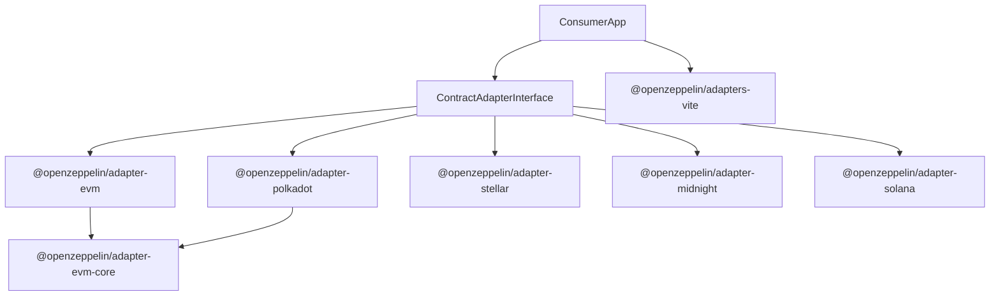

# Adapter Architecture Guide

This document is the source of truth for the architecture of packages in the
`openzeppelin-adapters` repository.

It describes what an adapter package is responsible for, how adapters should be
structured, how shared EVM-oriented code is reused, and how adapter-owned
build-time requirements are surfaced to consumer applications.

## Overview

OpenZeppelin adapters are chain-specific integration packages that let consumer
applications stay chain-agnostic.

Each public adapter package:

- implements the shared `ContractAdapter` contract from `@openzeppelin/ui-types`
- exports ecosystem metadata and supported networks
- encapsulates chain-specific loading, mapping, validation, transaction, query,
  wallet, and formatting logic
- may expose optional UI and export hooks when the ecosystem needs them

Repository boundaries:

- `openzeppelin-adapters`: chain-specific runtime and build-time adapter logic
- `openzeppelin-ui`: shared types, React integration, storage, and UI packages
- consumer apps like `ui-builder` and `role-manager`: choose supported
  ecosystems and compose adapters into an application

## Package Topology



### Current Packages

| Package | Purpose |
| --- | --- |
| `@openzeppelin/adapters-vite` | Shared Vite/Vitest integration helpers for consuming apps |
| `@openzeppelin/adapter-evm` | Public EVM ecosystem adapter |
| `@openzeppelin/adapter-polkadot` | Public Polkadot adapter built on the EVM core |
| `@openzeppelin/adapter-stellar` | Public Stellar/Soroban adapter |
| `@openzeppelin/adapter-midnight` | Public Midnight adapter |
| `@openzeppelin/adapter-solana` | Public Solana package scaffold |
| `@openzeppelin/adapter-evm-core` | Internal shared EVM functionality bundled into EVM-oriented adapters |

## Adapter Package Contract

All public adapters should expose a consistent public surface:

- root package export for the adapter runtime
- `./metadata` export for lightweight ecosystem metadata
- `./networks` export for static network definitions
- `./vite-config` export for adapter-owned build-time requirements

An adapter package should be network-aware. It is constructed with a
`NetworkConfig` and uses that configuration internally for RPC resolution,
explorer URLs, wallet behavior, execution settings, and ecosystem-specific
feature support.

## Standard Package Structure

Adapter packages should keep the main adapter class thin and push
ecosystem-specific behavior into dedicated modules.

```text
packages/adapter-<chain>/
├── src/
│   ├── adapter.ts
│   ├── config.ts
│   ├── metadata.ts
│   ├── networks.ts
│   ├── vite-config.ts
│   ├── contract/
│   ├── networks/
│   ├── configuration/
│   ├── query/
│   ├── transaction/
│   ├── wallet/
│   ├── mapping/
│   ├── transform/
│   ├── validation/
│   ├── access-control/
│   ├── export/
│   ├── analysis/
│   ├── types/
│   ├── utils/
│   └── __tests__/
├── package.json
├── tsconfig.json
├── tsdown.config.ts
├── vitest.config.ts
└── README.md
```

Not every adapter needs every directory. For example:

- `adapter-solana` is currently scaffolding-heavy and not production complete
- `adapter-midnight` has artifact/export and WASM-specific concerns
- `adapter-evm` and `adapter-polkadot` rely heavily on `adapter-evm-core`
- `adapter-polkadot` contains an `evm/` subtree that groups its
  EVM-compatible wrappers
- some packages use single files such as `browser-init.ts` or `configuration.ts`
  instead of a directory when the surface area is small

## Module Responsibilities

The sections below describe the core module families that appear across most
adapters, followed by additional module families that show up when an ecosystem
has richer needs.

### `adapter.ts`

- implements `ContractAdapter`
- owns adapter instance state such as `networkConfig`
- orchestrates calls into lower-level modules
- should avoid burying all chain logic in one large class

### `networks/`, `metadata.ts`, `networks.ts`

- define static network metadata and curated network lists
- keep lightweight data exports separate from heavy adapter runtime imports
- power consumer patterns like eager metadata loading and lazy runtime loading

### `configuration/`

- resolve explorer URLs, RPC endpoints, execution defaults, and service forms
- integrate with shared runtime configuration services when supported by the
  ecosystem

### `query/`

- implement read/view execution
- use the adapter's network context to connect to the right RPC or client

### `transaction/`

- format writes
- validate execution inputs
- execute transactions through one or more submission strategies

### `wallet/`

- isolate wallet-library-specific behavior
- expose optional React/UI helper capabilities through the shared adapter
  contract instead of coupling consumer apps to wallet SDKs directly

### `mapping/` and `transform/`

- map chain-native types into UI-friendly field definitions
- parse user inputs into chain-native values
- format results back into display-friendly output

## Additional Common Module Families

These modules are not required for every adapter, but they are common enough in
this repository that they should be treated as first-class architectural
patterns rather than one-off exceptions.

### `contract/` or ecosystem-definition loaders

- load chain-native contract definitions and convert them into shared schemas
- may appear as `contract/`, `abi/`, or another ecosystem-specific name
- often own format-specific parsing, transformation, and metadata extraction

Examples:

- `adapter-midnight/src/contract/`
- `adapter-stellar/src/contract/`
- `adapter-polkadot/src/evm/abi/`

### `validation/`

- provide adapter-specific validation rules beyond the shared interface surface
- commonly cover addresses, relayer config, execution constraints, or
  chain-specific invariants

Examples:

- `adapter-midnight/src/validation/`
- `adapter-stellar/src/validation/`

### `access-control/`

- encapsulate access-control feature detection, service implementations, action
  assembly, and optional indexer-backed lookups
- especially relevant for adapters that implement the richer
  `AccessControlService` contract

Examples:

- `adapter-stellar/src/access-control/`

### `export/`

- provide adapter-led export hooks such as `getExportBootstrapFiles()`
- generate files or initialization code that exported apps need at runtime
- keep ecosystem-specific export logic out of consumer app templates

Examples:

- `adapter-midnight/src/export/`

### `analysis/`

- host ecosystem-specific inspection or decoration logic that influences UI
  behavior without belonging directly to mapping, transform, query, or
  transaction code
- useful for feature detection, function decoration, or organizer-only analysis

Examples:

- `adapter-midnight/src/analysis/`

### `types/`

- contain adapter-internal types that should not be forced into shared packages
- useful when a package has enough internal type surface to justify a dedicated
  module rather than a single `types.ts`

Examples:

- `adapter-midnight/src/types/`
- `adapter-evm/src/types/`

### Runtime bootstrap helpers such as `config.ts`, `browser-init.ts`, or `configuration.ts`

- provide package-level setup or lightweight runtime wiring outside the main
  adapter class
- often handle environment initialization, browser shims, or package-level
  configuration exports

Examples:

- `adapter-midnight/src/browser-init.ts`
- `adapter-evm/src/config.ts`
- `adapter-stellar/src/config.ts`
- `adapter-stellar/src/configuration.ts`

### Wallet submodules: `components/`, `hooks/`, `context/`, `implementation/`, `services/`, `utils/`

- the top-level `wallet/` module often contains its own internal architecture
- keep React UI, provider context, SDK integration, and facade hooks separated
  instead of collapsing them into one file tree

Examples:

- `adapter-evm/src/wallet/components/`
- `adapter-stellar/src/wallet/context/`
- `adapter-stellar/src/wallet/services/`
- `adapter-midnight/src/wallet/implementation/`

### Ecosystem-specific subtrees such as `evm/`

- group a secondary architectural layer when an adapter embeds or wraps another
  family of behavior
- useful when a public adapter is ecosystem-branded but still delegates large
  parts of its runtime to a reusable subsystem

Examples:

- `adapter-polkadot/src/evm/`

## Shared EVM Core

`@openzeppelin/adapter-evm-core` exists to prevent duplication across
EVM-compatible adapters.

It centralizes reusable EVM logic such as:

- ABI loading and transformation
- proxy handling
- input/output conversion
- query helpers
- transaction formatting and execution flows
- wallet infrastructure
- network service resolution

Public EVM-oriented adapters should prefer composition through
`adapter-evm-core` over copy-pasting EVM runtime logic into multiple packages.

## Build-Time Integration

Most adapter code is runtime-only, but some ecosystems need build-time support.
That support is still adapter-owned.

### `vite-config` Contract

Every adapter must publish a `./vite-config` entry that returns its build-time
requirements as a Vite config fragment.

Typical concerns include:

- `resolve.dedupe` for singleton-sensitive libraries
- `optimizeDeps.include` or `optimizeDeps.exclude`
- Vite plugins for ecosystem-specific needs like WASM or top-level await
- `ssr.noExternal` where consumer tests or SSR pipelines need it

The root validation script enforces this contract:

- `src/vite-config.ts` must exist
- `package.json` must export `./vite-config`
- `tsdown.config.ts` must include `src/vite-config.ts` in its entry list

### Consumer Integration Through `@openzeppelin/adapters-vite`

Consuming apps should not reimplement an adapter config loader per repo.
Instead, they should use `@openzeppelin/adapters-vite`.

```ts
import { loadOpenZeppelinAdapterViteConfig } from '@openzeppelin/adapters-vite';

const adapterConfigs = await loadOpenZeppelinAdapterViteConfig({
  ecosystems: ['evm', 'stellar', 'polkadot'],
});
```

This shared package centralizes:

- ecosystem-to-package mapping
- loading of adapter `./vite-config` exports
- merged `plugins`, `resolve.dedupe`, `optimizeDeps`, and `ssr.noExternal`
- Vitest resolution helpers for installed adapter export entries

Apps still explicitly choose their supported ecosystems. That keeps the host app
in control without pushing adapter-specific build trivia into every consumer.

### Midnight Special Case

Midnight requires host-provided plugin factories for WASM and top-level await.
That is intentionally explicit:

```ts
const adapterConfigs = await loadOpenZeppelinAdapterViteConfig({
  ecosystems: ['midnight'],
  pluginFactories: {
    midnight: { wasm, topLevelAwait },
  },
});
```

This keeps Midnight's special build requirements close to the adapter while
making the dependency injection contract obvious in consuming apps.

## Export Bootstrap Files

Some adapters need to bundle ecosystem-specific artifacts into exported
applications. The shared contract supports this through optional export hooks
such as `getExportBootstrapFiles()`.

This is especially relevant for `adapter-midnight`, where exported apps need
artifact bootstrap code and bundled contract assets to work without runtime
artifact fetching.

If an adapter implements export bootstrap behavior, it should:

- keep the hook adapter-led and ecosystem-specific
- return generated files plus any required initialization/import snippets
- document what is bundled and why

## Contribution Checklist

When adding or refactoring an adapter:

1. Keep the adapter network-aware and aligned with `ContractAdapter`.
2. Prefer small modules over expanding `adapter.ts` into a monolith.
3. Reuse `adapter-evm-core` when building another EVM-compatible adapter.
4. Add or update `metadata`, `networks`, and `vite-config` exports as needed.
5. Validate build-time requirements with `pnpm validate:vite-configs`.
6. Add focused tests for the changed runtime or build-time behavior.
7. Update package documentation and this guide when architectural conventions
   change.

## Related Documentation

- [README.md](../README.md)
- [RUNBOOK.md](./RUNBOOK.md)
- [DEVOPS_SETUP.md](./DEVOPS_SETUP.md)
