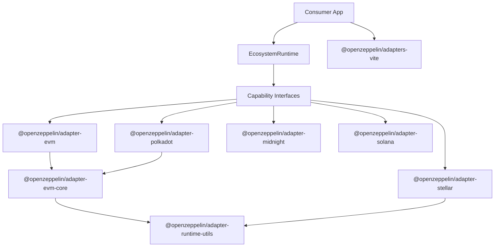

# Adapter Architecture Guide

This document is the source of truth for the architecture of packages in the
`openzeppelin-adapters` repository.

It describes what an adapter package is responsible for, how capabilities are
structured and composed, how shared EVM-oriented code is reused, and how
adapter-owned build-time requirements are surfaced to consumer applications.

## Overview

OpenZeppelin adapters are chain-specific integration packages that let consumer
applications stay chain-agnostic.

Each public adapter package:

- implements capability interfaces defined in `@openzeppelin/ui-types`
- exports ecosystem metadata, supported networks, and a `CapabilityFactoryMap`
- exposes a `createRuntime` function that composes capabilities into
  profile-scoped runtimes with shared state and lifecycle management
- encapsulates chain-specific loading, mapping, validation, transaction, query,
  wallet, and formatting logic behind narrow capability boundaries
- publishes each capability as a sub-path export for physical tier isolation

Repository boundaries:

- `openzeppelin-adapters`: chain-specific runtime and build-time adapter logic
- `openzeppelin-ui`: shared types, React integration, storage, and UI packages
- consumer apps like `ui-builder` and `role-manager`: choose supported
  ecosystems and consume adapters through profile runtimes or individual
  capabilities

## Capability Architecture

Adapter functionality is decomposed into 13 capability interfaces organized in
3 tiers. Each capability is a focused, composable interface representing one
area of adapter functionality.

### Tier Classification

| Tier | Category | Network Required | Wallet Required | Capabilities |
|------|----------|-----------------|-----------------|--------------|
| 1 | Lightweight / Declarative | No | No | Addressing, Explorer, NetworkCatalog, UiLabels |
| 2 | Schema / Definition | Yes | No | ContractLoading, Schema, TypeMapping, Query |
| 3 | Runtime / Stateful | Yes | Yes | Execution, Wallet, UiKit, Relayer, AccessControl |

Tier 1 capabilities are stateless. They do not extend `RuntimeCapability` and
can be used without a network connection. Tier 2 and Tier 3 capabilities extend
`RuntimeCapability`, carry a `readonly networkConfig`, and expose a `dispose()`
method for resource cleanup.

### Tier Import Rules

- Tier 1 modules MUST NOT import from Tier 2 or Tier 3 modules
- Tier 2 modules MAY import from Tier 1 modules
- Tier 3 modules MAY import from Tier 1 and Tier 2 modules
- This isolation is enforced physically through sub-path exports, not
  tree-shaking

### Capability Interfaces

All 13 capability interfaces are defined in `@openzeppelin/ui-types` as the
single source of truth:

| Capability | Interface | Tier | Key Methods |
|------------|-----------|------|-------------|
| Addressing | `AddressingCapability` | 1 | `isValidAddress` |
| Explorer | `ExplorerCapability` | 1 | `getExplorerUrl`, `getExplorerTxUrl?` |
| NetworkCatalog | `NetworkCatalogCapability` | 1 | `getNetworks` |
| UiLabels | `UiLabelsCapability` | 1 | `getUiLabels` |
| ContractLoading | `ContractLoadingCapability` | 2 | `loadContract`, `getContractDefinitionInputs` |
| Schema | `SchemaCapability` | 2 | `isViewFunction`, `getWritableFunctions` |
| TypeMapping | `TypeMappingCapability` | 2 | `getTypeMappingInfo`, `mapParameterTypeToFieldType` |
| Query | `QueryCapability` | 2 | `queryViewFunction`, `formatFunctionResult` |
| Execution | `ExecutionCapability` | 3 | `signAndBroadcast`, `validateExecutionConfig` |
| Wallet | `WalletCapability` | 3 | `connectWallet`, `disconnectWallet`, `getWalletConnectionStatus` |
| UiKit | `UiKitCapability` | 3 | `getAvailableUiKits`, `configureUiKit?` |
| Relayer | `RelayerCapability` | 3 | `getRelayers`, `getNetworkServiceForms` |
| AccessControl | `AccessControlCapability` | 3 | `registerContract`, `grantRole`, and 17 more |

## Profiles

Profiles are pre-composed bundles of capabilities matching common app
archetypes. They are convenience compositions — direct capability consumption
via the `CapabilityFactoryMap` is always available as an alternative.

### Profile–Capability Matrix

| Profile | Tier 1 (all 4) | Tier 2 | Tier 3 |
|---------|----------------|--------|--------|
| **Declarative** | Addressing, Explorer, NetworkCatalog, UiLabels | — | — |
| **Viewer** | Addressing, Explorer, NetworkCatalog, UiLabels | ContractLoading, Schema, TypeMapping, Query | — |
| **Transactor** | Addressing, Explorer, NetworkCatalog, UiLabels | ContractLoading, Schema, TypeMapping | Execution, Wallet |
| **Composer** | Addressing, Explorer, NetworkCatalog, UiLabels | ContractLoading, Schema, TypeMapping, Query | Execution, Wallet, UiKit, Relayer |
| **Operator** | Addressing, Explorer, NetworkCatalog, UiLabels | ContractLoading, Schema, TypeMapping, Query | Execution, Wallet, UiKit, AccessControl |

Every profile includes all 4 Tier 1 capabilities. Higher profiles are strict
supersets of Declarative.

### Profile Selection Guide

| Profile | Use When |
|---------|----------|
| Declarative | Metadata-only consumers (catalogs, explorers, address validators) |
| Viewer | Read-only contract interaction (dashboards, analytics) |
| Transactor | Write-only flows (simple send, approve, mint) |
| Composer | Full-featured UI Builder apps (read + write + wallet + relayer) |
| Operator | Role/permission management apps (read + write + access control) |

## Writing a Minimal Adapter

An adapter author does not need to implement all 13 capabilities. The
`CapabilityFactoryMap` type has every entry as optional — implement only the
capabilities your chain supports.

### Minimum Viable Adapter (Tier 1 Only)

The smallest valid adapter implements 4 Tier 1 capabilities, enabling
Declarative-profile consumers:

```ts
import type {
  AddressingCapability,
  CapabilityFactoryMap,
  EcosystemExport,
  ExplorerCapability,
  NetworkCatalogCapability,
  NetworkConfig,
  UiLabelsCapability,
} from '@openzeppelin/ui-types';

import { createRuntime } from './profiles';
import { metadata } from './metadata';
import { networks } from './networks';

function createAddressing(): AddressingCapability {
  return {
    isValidAddress(address: string): boolean {
      return /^0x[0-9a-fA-F]{40}$/.test(address);
    },
  };
}

function createExplorer(config?: NetworkConfig): ExplorerCapability {
  const baseUrl = config ? `https://explorer.example.com/${config.id}` : '';
  return {
    getExplorerUrl: (address) => `${baseUrl}/address/${address}`,
    getExplorerTxUrl: (txHash) => `${baseUrl}/tx/${txHash}`,
  };
}

function createNetworkCatalog(): NetworkCatalogCapability {
  return { getNetworks: () => networks };
}

function createUiLabels(): UiLabelsCapability {
  return { getUiLabels: () => ({ transactionLabel: 'Transaction' }) };
}

const capabilities: CapabilityFactoryMap = {
  addressing: createAddressing,
  explorer: createExplorer,
  networkCatalog: createNetworkCatalog,
  uiLabels: createUiLabels,
};

export const ecosystemDefinition: EcosystemExport = {
  ...metadata,
  networks,
  capabilities,
  createRuntime: (profile, config, options) =>
    createRuntime(profile, config, capabilities, options),
};
```

With this minimal adapter:
- `createRuntime('declarative', networkConfig)` succeeds
- `createRuntime('viewer', networkConfig)` throws `UnsupportedProfileError`
  listing `contractLoading`, `schema`, `typeMapping`, `query` as missing
- `createRuntime('operator', networkConfig)` throws `UnsupportedProfileError`
  listing all missing Tier 2 and Tier 3 capabilities

### Adding Higher-Tier Capabilities

To support profiles beyond Declarative, implement additional capabilities
incrementally:

1. **Viewer**: Add `contractLoading`, `schema`, `typeMapping`, `query`
2. **Transactor**: Add `contractLoading`, `schema`, `typeMapping`, `execution`,
   `wallet`
3. **Composer**: Add all Tier 2 + `execution`, `wallet`, `uiKit`, `relayer`
4. **Operator**: Add all Tier 2 + `execution`, `wallet`, `uiKit`,
   `accessControl`

Each Tier 2+ factory function must accept `NetworkConfig` and return a
capability object that includes `dispose()` for resource cleanup.

## Lifecycle Management

### Dispose-and-Recreate

Runtimes are immutable once created. Network changes require disposing the
current runtime and creating a new one:

```ts
let runtime = ecosystemDefinition.createRuntime('composer', networkA);

// When switching networks:
runtime.dispose();
runtime = ecosystemDefinition.createRuntime('composer', networkB);
```

### Dispose Contract

- `dispose()` is idempotent — calling it multiple times is a no-op
- After `dispose()`, any method or property access throws
  `RuntimeDisposedError`
- Pending async operations are rejected with `RuntimeDisposedError`
- Cleanup follows a staged order: mark disposed, reject pending operations,
  clean up listeners, subscriptions, capabilities, wallet, and RPC resources

### Standalone Capability Disposal

Tier 2+ capabilities obtained directly from `CapabilityFactoryMap` also expose
`dispose()`. Tier 1 capabilities are stateless and need no disposal.

## Package Topology



### Packages

| Package | Purpose |
| --- | --- |
| `@openzeppelin/adapters-vite` | Shared Vite/Vitest integration helpers for consuming apps |
| `@openzeppelin/adapter-evm` | Public EVM ecosystem adapter (re-exports from evm-core) |
| `@openzeppelin/adapter-polkadot` | Public Polkadot adapter built on the EVM core |
| `@openzeppelin/adapter-stellar` | Public Stellar/Soroban adapter |
| `@openzeppelin/adapter-midnight` | Public Midnight adapter |
| `@openzeppelin/adapter-solana` | Public Solana package scaffold |
| `@openzeppelin/adapter-evm-core` | Internal shared EVM capability implementations |
| `@openzeppelin/adapter-runtime-utils` | Internal shared profile composition and runtime lifecycle utilities |

## Standard Package Structure

```text
packages/adapter-<chain>/
├── src/
│   ├── capabilities/          # Capability factory functions
│   │   ├── addressing.ts
│   │   ├── explorer.ts
│   │   ├── network-catalog.ts
│   │   ├── ui-labels.ts
│   │   ├── contract-loading.ts
│   │   ├── schema.ts
│   │   ├── type-mapping.ts
│   │   ├── query.ts
│   │   ├── execution.ts
│   │   ├── wallet.ts
│   │   ├── ui-kit.ts
│   │   ├── relayer.ts
│   │   ├── access-control.ts
│   │   ├── index.ts
│   │   └── __tests__/
│   ├── profiles/              # Profile runtime factories
│   │   ├── shared-state.ts
│   │   ├── declarative.ts
│   │   ├── viewer.ts
│   │   ├── transactor.ts
│   │   ├── composer.ts
│   │   ├── operator.ts
│   │   └── index.ts
│   ├── index.ts               # ecosystemDefinition export
│   ├── config.ts
│   ├── metadata.ts
│   ├── networks.ts
│   ├── vite-config.ts
│   ├── contract/              # Chain-specific internal modules
│   ├── query/
│   ├── transaction/
│   ├── wallet/
│   ├── mapping/
│   ├── validation/
│   └── __tests__/
├── package.json
├── tsconfig.json
├── tsdown.config.ts
├── vitest.config.ts
└── README.md
```

Not every adapter needs every capability or internal module. A minimal adapter
may only have `capabilities/addressing.ts`, `capabilities/explorer.ts`,
`capabilities/network-catalog.ts`, and `capabilities/ui-labels.ts`.

## Sub-Path Exports

Each adapter publishes capabilities and profiles as sub-path exports for
physical tier isolation:

```json
{
  "exports": {
    ".": { "import": "./dist/index.mjs", "require": "./dist/index.cjs" },
    "./addressing": { "import": "./dist/capabilities/addressing.mjs" },
    "./explorer": { "import": "./dist/capabilities/explorer.mjs" },
    "./network-catalog": { "import": "./dist/capabilities/network-catalog.mjs" },
    "./ui-labels": { "import": "./dist/capabilities/ui-labels.mjs" },
    "./contract-loading": { "import": "./dist/capabilities/contract-loading.mjs" },
    "./schema": { "import": "./dist/capabilities/schema.mjs" },
    "./type-mapping": { "import": "./dist/capabilities/type-mapping.mjs" },
    "./query": { "import": "./dist/capabilities/query.mjs" },
    "./execution": { "import": "./dist/capabilities/execution.mjs" },
    "./wallet": { "import": "./dist/capabilities/wallet.mjs" },
    "./ui-kit": { "import": "./dist/capabilities/ui-kit.mjs" },
    "./relayer": { "import": "./dist/capabilities/relayer.mjs" },
    "./access-control": { "import": "./dist/capabilities/access-control.mjs" },
    "./profiles/declarative": { "import": "./dist/profiles/declarative.mjs" },
    "./profiles/viewer": { "import": "./dist/profiles/viewer.mjs" },
    "./profiles/transactor": { "import": "./dist/profiles/transactor.mjs" },
    "./profiles/composer": { "import": "./dist/profiles/composer.mjs" },
    "./profiles/operator": { "import": "./dist/profiles/operator.mjs" },
    "./metadata": { "import": "./dist/metadata.mjs" },
    "./networks": { "import": "./dist/networks.mjs" },
    "./vite-config": { "import": "./dist/vite-config.mjs" }
  }
}
```

This ensures that importing `@openzeppelin/adapter-stellar/addressing` does
not pull in wallet, transaction, or access-control dependencies regardless of
bundler configuration.

## Module Responsibilities

### `capabilities/`

Each file exports a factory function (`createAddressing`, `createExplorer`,
etc.) that returns an object satisfying the corresponding capability interface
from `@openzeppelin/ui-types`. Tier 1 factories may accept an optional
`NetworkConfig`; Tier 2+ factories require it.

### `profiles/`

Profile factories compose capabilities with shared internal state (capability
cache, event bus, wallet manager). The `shared-state.ts` module wraps
`@openzeppelin/adapter-runtime-utils` with adapter-specific wiring. The
`index.ts` barrel exports `createRuntime` which validates profile requirements
and delegates to the appropriate profile factory.

### `networks/`, `metadata.ts`, `networks.ts`

- define static network metadata and curated network lists
- keep lightweight data exports separate from heavy adapter runtime imports
- power consumer patterns like eager metadata loading and lazy runtime loading

### Internal modules (`contract/`, `query/`, `transaction/`, `wallet/`, `mapping/`, `validation/`)

- contain chain-specific implementation details
- are wrapped by capability factory functions in `capabilities/`
- are not exported directly from the package

## Shared EVM Core

`@openzeppelin/adapter-evm-core` exists to prevent duplication across
EVM-compatible adapters.

It centralizes reusable EVM capability implementations including:

- ABI loading and transformation (ContractLoading)
- proxy handling
- input/output conversion (TypeMapping)
- query helpers (Query)
- transaction formatting and execution flows (Execution)
- wallet infrastructure (Wallet)
- network service resolution (Relayer)
- access control service (AccessControl)

Public EVM-oriented adapters should prefer composition through
`adapter-evm-core` over copy-pasting EVM runtime logic into multiple packages.

## Shared Runtime Utilities

`@openzeppelin/adapter-runtime-utils` centralizes profile composition and
runtime lifecycle management shared across all adapters:

- `PROFILE_REQUIREMENTS`: the canonical profile-capability matrix
- `createRuntimeFromFactories`: composes a profile runtime from a factory map
  with lazy capability instantiation, caching, and staged disposal
- `isProfileName`: type guard for valid profile names
- Runtime event bus, capability caching, and dispose orchestration

Adapter-specific `profiles/shared-state.ts` modules wrap these utilities,
keeping the shared logic DRY while allowing adapter-specific wiring.

## Build-Time Integration

Most adapter code is runtime-only, but some ecosystems need build-time support.
That support is still adapter-owned.

### `vite-config` Contract

Every adapter must publish a `./vite-config` entry that returns its build-time
requirements as a Vite config fragment.

Typical concerns include:

- `resolve.dedupe` for singleton-sensitive libraries
- `optimizeDeps.include` or `optimizeDeps.exclude`
- Vite plugins for ecosystem-specific needs like WASM or top-level await
- `ssr.noExternal` where consumer tests or SSR pipelines need it

The root validation script enforces this contract:

- `src/vite-config.ts` must exist
- `package.json` must export `./vite-config`
- `tsdown.config.ts` must include `src/vite-config.ts` in its entry list

### Consumer Integration Through `@openzeppelin/adapters-vite`

Consuming apps should not reimplement an adapter config loader per repo.
Instead, they should use `@openzeppelin/adapters-vite`.

```ts
import { loadOpenZeppelinAdapterViteConfig } from '@openzeppelin/adapters-vite';

const adapterConfigs = await loadOpenZeppelinAdapterViteConfig({
  ecosystems: ['evm', 'stellar', 'polkadot'],
});
```

This shared package centralizes:

- ecosystem-to-package mapping
- loading of adapter `./vite-config` exports
- merged `plugins`, `resolve.dedupe`, `optimizeDeps`, and `ssr.noExternal`
- Vitest resolution helpers for installed adapter export entries

Apps still explicitly choose their supported ecosystems. That keeps the host app
in control without pushing adapter-specific build trivia into every consumer.

### Midnight Special Case

Midnight requires host-provided plugin factories for WASM and top-level await.
That is intentionally explicit:

```ts
const adapterConfigs = await loadOpenZeppelinAdapterViteConfig({
  ecosystems: ['midnight'],
  pluginFactories: {
    midnight: { wasm, topLevelAwait },
  },
});
```

This keeps Midnight's special build requirements close to the adapter while
making the dependency injection contract obvious in consuming apps.

## Export Bootstrap Files

Some adapters need to bundle ecosystem-specific artifacts into exported
applications. The shared contract supports this through optional export hooks
such as `getExportBootstrapFiles()`.

This is especially relevant for `adapter-midnight`, where exported apps need
artifact bootstrap code and bundled contract assets to work without runtime
artifact fetching.

If an adapter implements export bootstrap behavior, it should:

- keep the hook adapter-led and ecosystem-specific
- return generated files plus any required initialization/import snippets
- document what is bundled and why

## Contribution Checklist

When adding or refactoring an adapter:

1. Implement capability interfaces from `@openzeppelin/ui-types`. Start with
   all 4 Tier 1 capabilities for Declarative-profile support.
2. Export each capability as a factory function in `src/capabilities/`.
3. Wire profile factories in `src/profiles/` using
   `@openzeppelin/adapter-runtime-utils`.
4. Add sub-path exports to `package.json` and entry points to
   `tsdown.config.ts` for every implemented capability and profile.
5. Export `ecosystemDefinition` conforming to `EcosystemExport` with
   `capabilities` and `createRuntime`.
6. Add or update `metadata`, `networks`, and `vite-config` exports as needed.
7. Validate build-time requirements with `pnpm validate:vite-configs`.
8. Add tests for each capability factory and profile runtime creation, including
   `UnsupportedProfileError` assertions for unsupported profiles.
9. Verify tier isolation: Tier 1 sub-path imports must not pull Tier 2/3
   dependencies.
10. Update package documentation and this guide when architectural conventions
    change.

## Related Documentation

- [README.md](../README.md)
- [RUNBOOK.md](./RUNBOOK.md)
- [DEVOPS_SETUP.md](./DEVOPS_SETUP.md)
